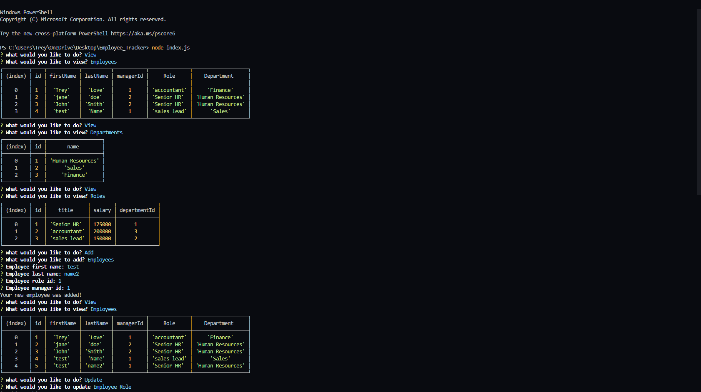

# Employee_Tracker

## Description 
Employee Tracker is an command line application that allows employers to manage by creating them a database the holds their employees, job roles and departments. This application is powered by node.js the inquirer npm package and MySQL. Current functionality the application supports is viewing , adding and modifying database information regarding to company employees, roles, departments and salarys. 

## Instructions
* Download MySql workbench
* Clone this repository to your PC
* Open the employee_db SQL file in MySql and run the included code
* Open the index.js file and install dependencies from the package.json file 
* Open the index.js in to begin the application
* You will be presented with options once you the application runs. 
* Use the arrow keys to traverse the prompts and type in the necessary information when prompted.
* Press control + c to close the application.

## Examples 
[Video of working application](https://drive.google.com/file/d/1l9g1bNgj0J8_hX4DMsepgmOuAZ1VkHKI/view)

